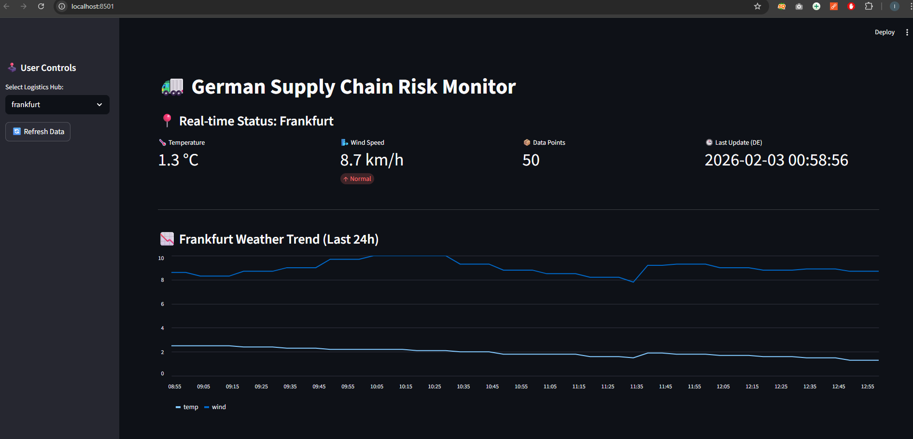
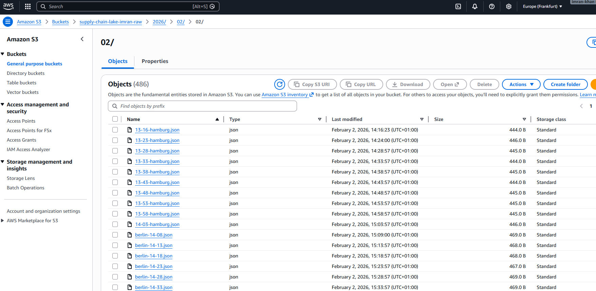
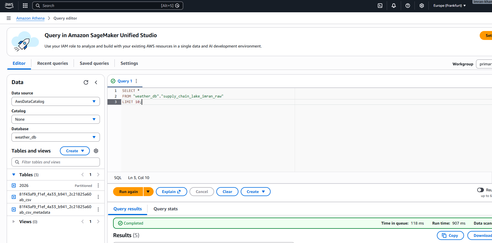

# 🚛 German Supply Chain Risk Monitor (AWS Serverless Data Lake)

  

##  Project Overview
In the German logistics sector (e.g., DHL, DB Schenker), "Just-in-Time" delivery chains are highly vulnerable to weather disruptions. Most logistics AI models fail because they lack **granular historical weather data**, as commercial APIs are expensive and limit historical access.

**The Solution:**
I built a **Serverless Data Lake** on AWS that automatically ingests, archives, and catalogs real-time weather risk data (Temperature, Wind Speed, Snow) for major German logistics hubs (Hamburg, Frankfurt, Berlin, Munich). It creates a **proprietary historical dataset** for future AI risk modeling at **zero ongoing cost**.

---

## 📸 Dashboard Preview
*Real-time monitoring of Frankfurt Hub with live "High Wind" alerts and 24h trend analysis. The system automatically converts UTC server time to Local German Time.*



---

##  Architecture
This system follows the **"Lakehouse"** architecture pattern, entirely serverless.

1.  **Ingestion (AWS Lambda):** A Python-based extractor runs every 5 minutes (via **EventBridge**), fetching real-time data from the Open-Meteo API for multiple cities.
2.  **Storage (Amazon S3):** Data is stored as JSON objects in a partitioned Raw Zone (`/year/month/day/city-time.json`), ensuring durability and scalability.
3.  **Catalog (AWS Glue):** A Glue Crawler automatically infers the schema and updates the Data Catalog, handling schema evolution (e.g., adding new cities dynamically).
4.  **Analytics (Amazon Athena):** Serverless SQL engine allows for ad-hoc querying of the raw JSON logs without managing any database infrastructure.
5.  **Visualization (Streamlit):** A Python dashboard connects to Athena to visualize real-time risk trends for supply chain managers.

###  Data Lake Evidence (S3 Raw Zone)
*Data is automatically partitioned by Date (`YYYY/MM/DD`), allowing for efficient querying and cost management.*


###  Serverless Analytics (Athena)
*Direct SQL querying of raw JSON files without a database server. This proves the Glue Crawler successfully cataloged the data.*


---

##  Tech Stack
* **Cloud:** AWS (Lambda, S3, Glue, Athena, EventBridge, IAM)
* **Language:** Python 3.9 (Boto3, Pandas)
* **Visualization:** Streamlit
* **Security:** Least Privilege IAM Roles, Environment Variables (`.env`) for credentials.

---

##  How to Run Locally

### 1. Prerequisites
* Python 3.9+
* AWS Credentials with access to Athena/S3

### 2. Installation
```bash
pip install -r requirements.txt
